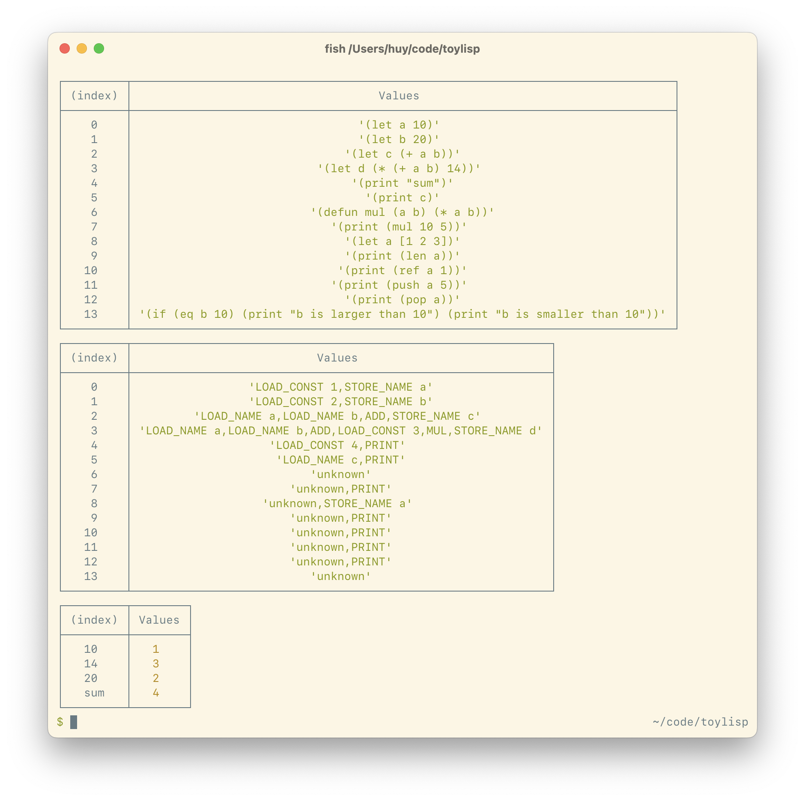

# 06.04.2022 - Compiling IF statement

If statements and function are the tricky thing to me, now I have to add label support, a label is also a statement that has the form of:

```
.<label_name>
```

Ideally, the instruction list will be able to keep track of the label position, so it can jump to a label at any time.

An If statement has the form of:

```lisp
(if (condition-statement)
    (then-statement)
    (else-statement))
```

My main goal is to use as less instructions as possible when compiling these statement. So, for each If statement, two new labels will be created to identify the else statement and the end of the if statement:

```
<condition-instructions>
JMP_FALSE .label_1_else
<then-instructions>
JMP .label_1_end
.label_1_else:
<else-instructions>
.label_1_end:
```

The `JMP_FALSE` instruction will make a jump if the result of the condition statement is falsy, otherwise, the execution will continue at the them instructions. When finished executing the then code, we need to make a jump to the end label, or the program will be continued at the else instructions.

If the If statement have no else branch, we can still generate the label and leave the code for it empty, it make the compiling logic much shorter and easier to understand.

# 05.20.2022 - Adding symbol table

Not much for today, just adding some unit tests and implement a symbol table during the compilation process. The way it works is pretty much like the Constant Table that was mentioned yesterday.

If we have a let statement like in the following example, after the compilation process, the `STORE_NAME` opcode will be generated with the address of the `a` symbol.

```
(let a 10)

LOAD_CONST 1  ; Constant 10
STORE_NAME 1  ; Symbol a
```

The Constants table would look like this:

|value|index |
|:----|:----:|
|50   |1     |

And the Symbols table would look like this:

|value|index |
|:----|:----:|
|a    |1     |

For now, I'm reusing the `ConstantTable` class from yesterday, renamed it to `LookupTable`, so both Constants and Symbols table shared the same behavior: If a value is looked up and not found, it will automatically insert to the table and return the address. But maybe I'll need to revise this, as it may not make any sense to load a symbol before it's being created, like in this following code:

```
(let a (* 10 x))

LOAD_CONST 1  ; Constant 10
LOAD_NAME  1  ; Symbol x !! use before create
STORE_NAME 2  ; Symbol a
```

Still trying to find what is the best way to generate function calls. Once I implemented a proper function call, I can extend the language much further, for example, I've been thinking of adding string interpolation (or string template, in JS). But I'll need to change both the parser and the compiler for this job. With function, we can do it easily with:

```
(print
    (concat "there are" count "bugs"))
```

# 05.19.2022 - Work in progress compiling logic

Started working on compiling logic, at this point, the compiler is capable of generating the opcode for the `print`, `let` statement and some arithmetic operators.



Since I don't control the parsing flow (using generated code, thanks PeggyJS), I'm gonna handle the constant values (like numbers or strings) during the compilation process. The idea is, whenever we see a constant, we push it to the constant table and get the address of that value to use in the generated code.

So, for example, with a `let` statement, the generated code would be like this:

```
(let a 10)

LOAD_CONST 1
STORE_NAME a
```

After this, the constant table would contains one value, it look like this:

|value|index |
|:----|:----:|
|10   |1     |

For storing variables, I'll just generate the opcode as `STORE_NAME <name>` for now. The right way to do this is to create another Symbol table, that handle the binding between the variable name and the constant value location. That's for the next commit.

Also, I realized I made it this far but forgot to write a proper unit tests :( so had to stop and setup some tests. Jest is my test runner of choice, and set it up with ESBuild and TypeScript support seems to be a piece of cake.

The `console.table` method is pretty handful to debug tabular data like arrays or simple objects.

See commit [1405c28](https://github.com/huytd/toylisp/commit/1405c28).

# 05.18.2022 - Generating parser code with PeggyJS

For this project, I'll just use a generator to create parser code, as I want to focus on the bytecode virtual machine.

PeggyJS is the best generator I could find for now, it even supports TypeScript, this mean, we can control the return type for each non-terminals.

See commit [dd6e44](https://github.com/huytd/toylisp/commit/dd6e4465).
